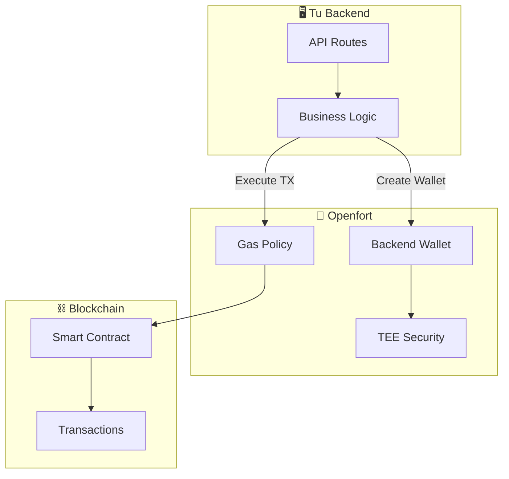
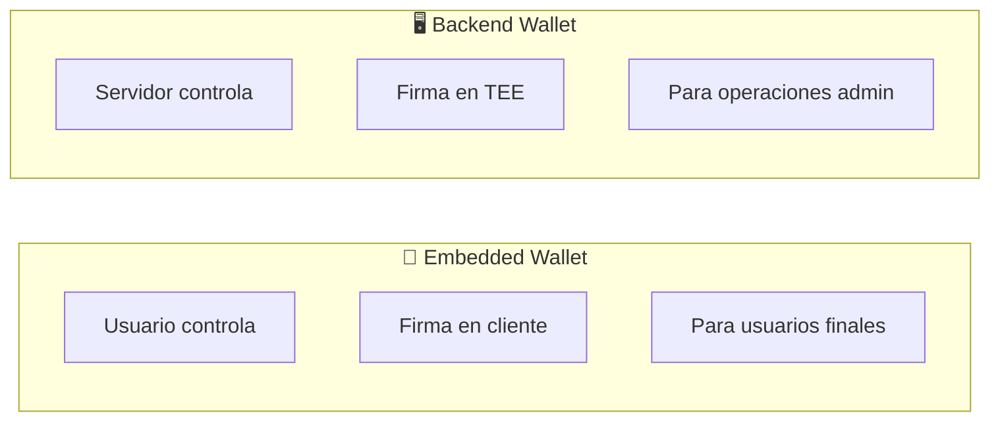
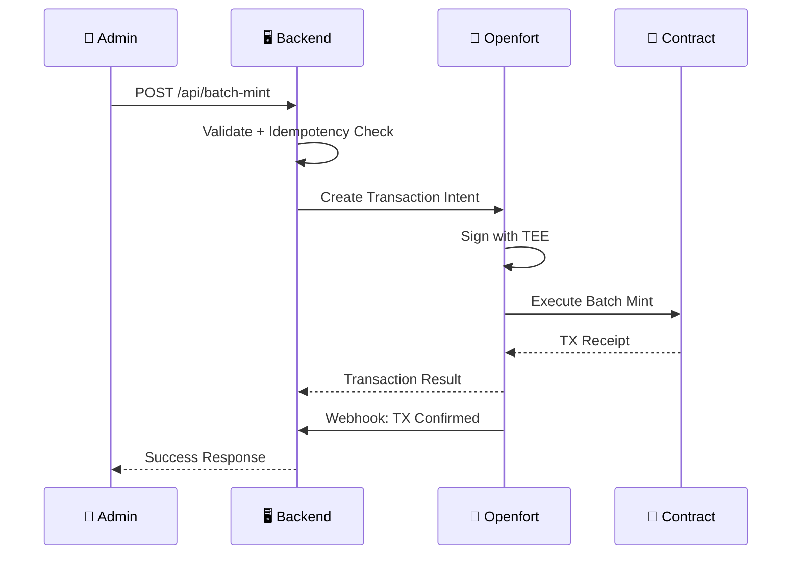
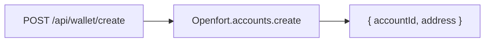
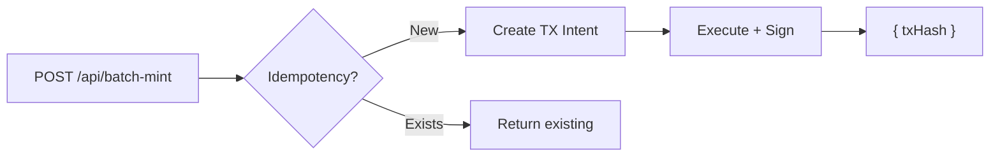
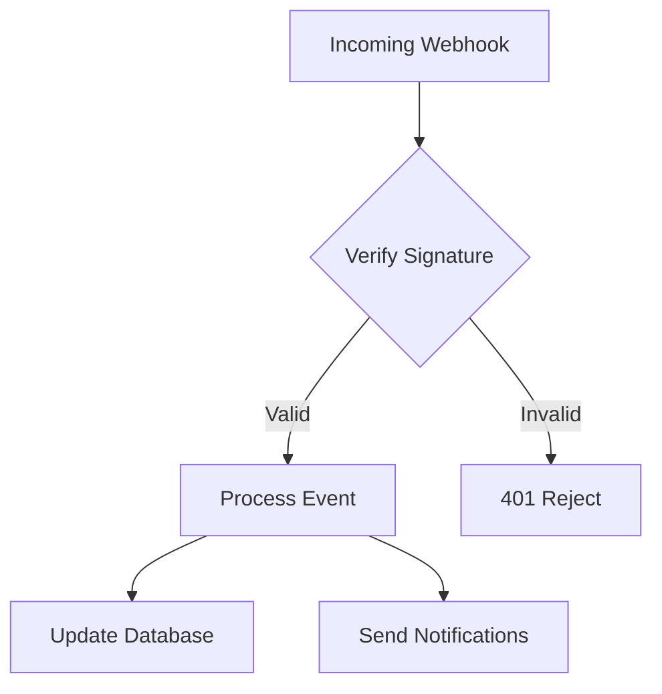
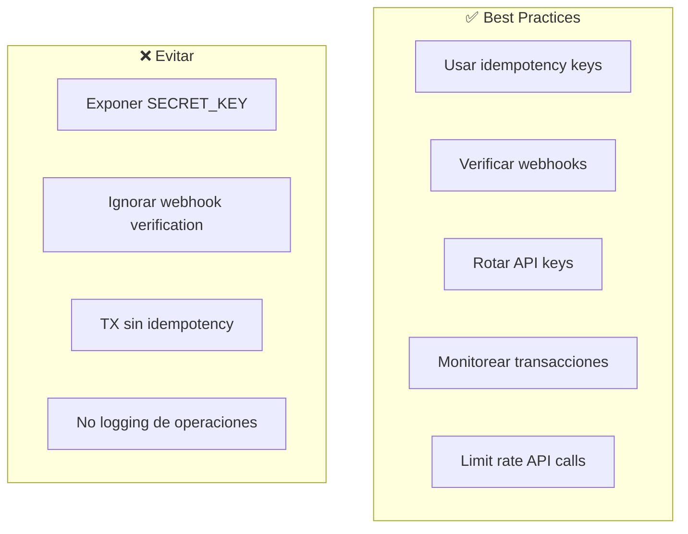

# Openfort Backend Wallets

[](https://opensource.org/licenses/MIT)
[](https://nextjs.org/)
[](https://openfort.xyz)

Wallets controladas por backend usando Openfort con seguridad TEE (Trusted Execution Environment). Ideal para operaciones server-side como batch minting, airdrops, y treasury management.

## 🎥 Video Tutorial

Este repositorio acompaña el video tutorial de CodaLabs:
**[Openfort Backend Wallets: Control Server-Side de Wallets](https://youtube.com/@CodaLabs)**

## ✨ Características

- 🔐 **Seguridad TEE** — Claves protegidas en hardware
- 🏭 **Batch Operations** — Mint múltiples NFTs en una transacción
- 🔄 **Idempotency** — Reintentos seguros sin duplicados
- 📡 **Webhooks** — Notificaciones en tiempo real
- ⛽ **Gas Sponsorship** — Transacciones sin gas para usuarios

## 🏗️ Arquitectura



## 🔐 Backend Wallet vs Embedded Wallet



| Aspecto | Embedded Wallet | Backend Wallet |
|---------|-----------------|----------------|
| Control | Usuario | Tu servidor |
| Firma | Cliente | TEE (server) |
| Uso | User wallets | Treasury, Minting |
| Seguridad | User device | Hardware TEE |

## 🔄 Flujo de Batch Minting



## 📁 Estructura del Proyecto

```
openfort-backend-wallets/
├── app/
│   ├── page.tsx                      # Admin Dashboard
│   ├── layout.tsx
│   └── api/
│       ├── wallet/
│       │   └── create/route.ts       # Crear backend wallet
│       ├── batch-mint/
│       │   └── route.ts              # Batch minting
│       └── webhooks/
│           └── openfort/route.ts     # Webhook handler
├── lib/
│   ├── openfort-admin.ts             # Openfort client
│   └── utils.ts                      # Utilities
├── .env.example
├── LICENSE
└── README.md
```

## 🚀 Quick Start

### 1. Clonar el Repositorio

```bash
git clone https://github.com/CodaLabs-xyz/openfort-backend-wallets.git
cd openfort-backend-wallets
npm install
```

### 2. Configurar Variables de Entorno

```bash
cp .env.example .env.local
```

```env
# Openfort (de Dashboard)
OPENFORT_SECRET_KEY=sk_live_...

# Policy ID para gas sponsorship
OPENFORT_POLICY_ID=pol_...

# Webhook secret (generado en Dashboard)
OPENFORT_WEBHOOK_SECRET=whsec_...
```

### 3. Ejecutar

```bash
npm run dev
```

Abre [http://localhost:3000](http://localhost:3000) para ver el dashboard.

## 🔧 API Endpoints

### POST /api/wallet/create

Crea una nueva backend wallet.



```typescript
// Request
{
  "name": "treasury",
  "chainId": 80002
}

// Response
{
  "accountId": "acc_...",
  "address": "0x...",
  "chainId": 80002
}
```

### POST /api/batch-mint

Mint múltiples NFTs en una transacción.



```typescript
// Request
{
  "accountId": "acc_...",
  "contractAddress": "0x...",
  "recipients": ["0x...", "0x..."],
  "idempotencyKey": "batch-001"  // opcional
}

// Response
{
  "transactionIntentId": "tin_...",
  "status": "pending",
  "txHash": "0x..."
}
```

### POST /api/webhooks/openfort

Recibe eventos de Openfort.



```typescript
// Event types
- transaction_intent.succeeded
- transaction_intent.failed
- transaction_intent.cancelled
```

## 📚 Código de Ejemplo

### Crear Backend Wallet

```typescript
// lib/openfort-admin.ts
import Openfort from '@openfort/openfort-node';

const openfort = new Openfort(process.env.OPENFORT_SECRET_KEY!);

export async function createBackendWallet(name: string, chainId: number) {
  const account = await openfort.accounts.create({
    chainId,
    externalOwnerAddress: null, // Backend-controlled
  });
  
  return {
    accountId: account.id,
    address: account.address,
  };
}
```

### Batch Mint con Idempotency

```typescript
export async function batchMint(
  accountId: string,
  contractAddress: string,
  recipients: string[],
  idempotencyKey?: string
) {
  // Encode multicall data
  const calls = recipients.map(recipient => ({
    to: contractAddress,
    data: encodeMintFunction(recipient),
    value: '0',
  }));

  const intent = await openfort.transactionIntents.create({
    player: accountId,
    chainId: 80002,
    policy: process.env.OPENFORT_POLICY_ID,
    interactions: calls,
  }, {
    idempotencyKey,  // Previene duplicados
  });

  return intent;
}
```

### Verificar Webhook

```typescript
import crypto from 'crypto';

export function verifyWebhook(
  payload: string,
  signature: string,
  secret: string
): boolean {
  const computed = crypto
    .createHmac('sha256', secret)
    .update(payload)
    .digest('hex');
    
  return crypto.timingSafeEqual(
    Buffer.from(signature),
    Buffer.from(computed)
  );
}
```

## ⚠️ Seguridad



**Checklist de seguridad:**
- ✅ `OPENFORT_SECRET_KEY` solo en servidor
- ✅ Verificar firma de todos los webhooks
- ✅ Usar idempotency keys para transacciones
- ✅ Implementar rate limiting
- ✅ Logging de todas las operaciones
- ✅ Alertas para transacciones fallidas

## 🐛 Troubleshooting

<details>
<summary><b>Error: "Invalid API key"</b></summary>

- Verifica que uses la SECRET_KEY (sk_...), no la publishable
- Revisa que no haya espacios extra
- Confirma que la key no haya expirado

</details>

<details>
<summary><b>Transaction stuck in pending</b></summary>

- Verifica gas policy y balance
- Revisa chain ID correcto
- Usa webhooks para tracking

</details>

<details>
<summary><b>Webhook not receiving events</b></summary>

- Verifica URL pública (HTTPS)
- Revisa webhook secret
- Confirma eventos habilitados en Dashboard

</details>

<details>
<summary><b>Duplicate transactions</b></summary>

- Implementa idempotency keys
- Usa UUID único por operación
- Verifica antes de crear nueva TX

</details>

## 🔗 Recursos

- [Documentación Openfort](https://openfort.io/docs)
- [Backend Wallets Guide](https://openfort.io/docs/guides/backend-wallets)
- [Webhooks Guide](https://openfort.io/docs/guides/webhooks)
- [Transaction Intents](https://openfort.io/docs/guides/transaction-intents)
- [Serie de Videos CodaLabs](https://youtube.com/@CodaLabs)

## 📄 Licencia

Este proyecto está bajo la licencia MIT. Ver [LICENSE](LICENSE) para más detalles.

---

<p align="center">
  Made with ❤️ by <a href="https://github.com/CodaLabs-xyz">CodaLabs</a>
</p>
